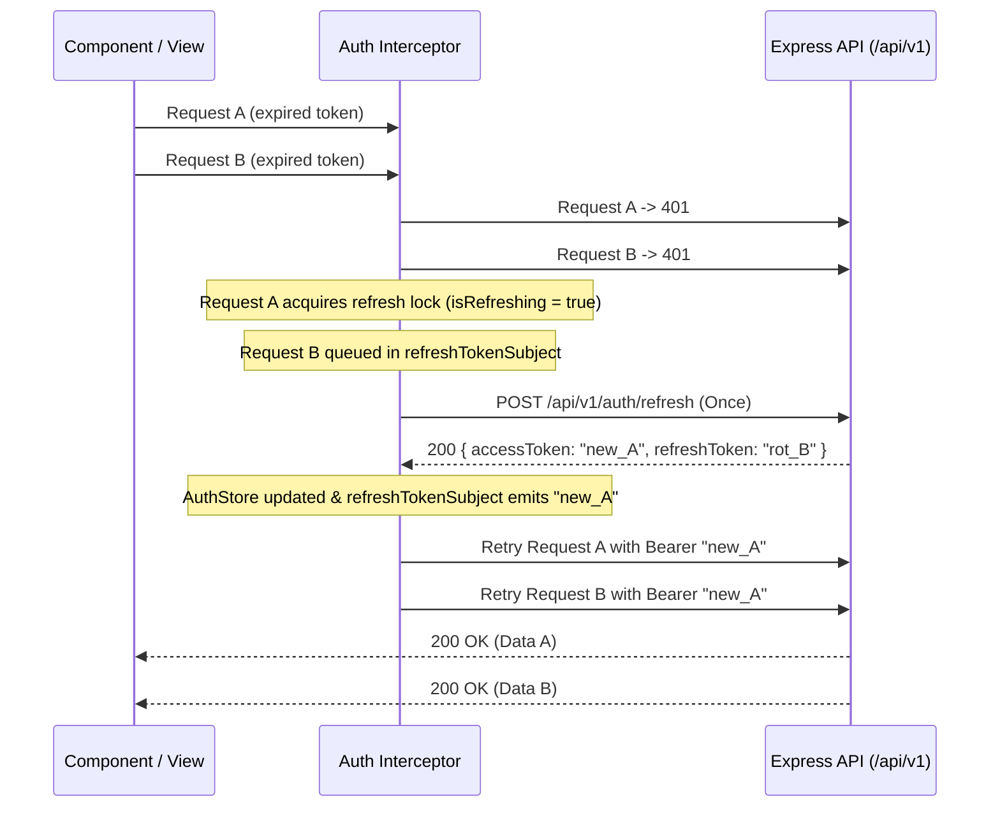

# EventHub Frontend

Modern, high-performance web frontend for the **EventHub** event discovery and ticket reservation platform. Built with standalone Angular 22, NgRx SignalStore, PrimeNG, and Tailwind CSS.

---

## Quick Start

### 1. Prerequisites
- **Node.js** >= 20 (v22+ recommended)
- **Running EventHub Backend** on `http://localhost:3000` (Express + PostgreSQL + GraphQL)

### 2. Install Dependencies
```bash
cd frontend
npm install --legacy-peer-deps
```

### 3. Start Development Server
```bash
npm start
```
The Angular application will be available at **`http://localhost:4200`**.

### 4. Running Both Backend and Frontend Together
In one terminal (backend root):
```bash
npm run dev
# Starts Express REST & GraphQL server on http://localhost:3000
```

In a second terminal (`frontend/`):
```bash
cd frontend
npm start
# Serves the Angular application on http://localhost:4200
```

---

## Architectural Decisions & Rationale

```
frontend/src/app/
  core/
    auth/          # NgRx SignalStore, authGuard, roleGuard
    http/          # API client services, auth interceptor, error handler
    models/        # Strictly typed TypeScript interfaces matching backend Zod & Prisma schemas
  features/
    auth/          # Login & Register with typed reactive forms and server-error mapping
    events/        # Event listing with debounced search/filters, event detail & live seat booking
    bookings/      # Attendee reservation list & optimistic cancellation
    organizer/     # Organizer GraphQL analytics dashboard, event create/edit form, attendee CSV export
  shared/          # Reusable components (Navbar, Footer, OccupancyBar, RateLimitBanner, Pipes)
```

### 1. Angular Standalone Architecture & Signals
- **Standalone Components**: Every component, directive, and pipe is standalone (`standalone: true`), eliminating NgModules and maximizing tree-shakability.
- **Signals & Computed**: Local component states utilize Angular Signals (`signal()`, `computed()`) for fine-grained reactivity.
- **`OnPush` Change Detection**: Applied across all components for maximum rendering efficiency and minimal CD cycles.
- **Modern Control Flow**: Uses native `@if`, `@for` (with unique `track`), and `@switch` syntax.

### 2. State Management with NgRx SignalStore
- **`AuthStore`**: Shared authentication state (current user profile, in-memory access token, refresh token reference, and active rate limit countdowns).
- **Computed Selectors**: `isAuthenticated`, `isOrganizer`, `isAdmin`, `userRole`, `currentUserId`.
- **Security-Conscious Token Storage**:
  - The **access token is stored in-memory only** inside the signal store. It is never placed in `localStorage`, reducing the blast radius of potential XSS token theft.
  - The **refresh token is stored in `localStorage`** to allow session survival across page reloads.
  - *Production Note*: In an enterprise deployment, refresh tokens would ideally be transmitted via `httpOnly`, `Secure`, `SameSite=Strict` cookies set directly by the server to avoid script access entirely.

### 3. Synchronized Token Refresh Queue (Stampede Prevention)
The backend enforces rotating refresh tokens (`POST /api/v1/auth/refresh`), which invalidates previous refresh tokens. If multiple asynchronous API requests fail with `401 Unauthorized` simultaneously, firing multiple uncoordinated refresh calls would cause a race condition where each refresh invalidates the token of the other.

**How the Interceptor Resolves This (`auth.interceptor.ts`)**:
1. When a `401` is caught, the interceptor checks the `isRefreshing` lock.
2. The **first request** sets `isRefreshing = true`, resets `refreshTokenSubject`, and triggers a single `POST /api/v1/auth/refresh`.
3. **Concurrent requests** enter the `else` branch, subscribing to `refreshTokenSubject.pipe(filter(token => token !== null), take(1))`.
4. When the refresh succeeds, the new rotated tokens are saved to `AuthStore`, the new access token is emitted to `refreshTokenSubject`, and all queued requests retry in parallel with the fresh token.
5. If the refresh fails (e.g. token expired), `isRefreshing` is cleared, `authStore.logout()` executes, and the user is redirected to `/login`.



### 4. GraphQL Integration (`/graphql`)
- The backend exposes GraphQL specifically for analytics. The frontend utilizes `AnalyticsGraphqlService` backed by `HttpClient` to query `organizerStats`, `myEvents`, and `eventStats`.
- By routing GraphQL requests through `HttpClient`, they automatically inherit `authInterceptor` authorization headers, error handling, and silent refresh queueing without external library bloat.

### 5. Error Mapping & Rate Limit Handling
- Standard error envelope: `{ error: { message, code, details } }`.
- `VALIDATION_ERROR`: Zod issue paths are mapped directly onto the corresponding `FormControl` errors using `ErrorHandlerService.mapValidationErrorsToForm()`.
- `SOLD_OUT`: When booking fails with `SOLD_OUT`, the event detail component displays a clear notification and **immediately refetches event details** to refresh live capacity and seat counts.
- `RATE_LIMITED`: The interceptor extracts the `RateLimit-Reset` header and triggers the `RateLimitBannerComponent` countdown timer in the UI.

---

## Screen Highlights

1. **Public Event Discovery (`/events`)**:
   - Debounced search (300ms), venue filter, sort selectors (date, price, capacity, title).
   - Server-driven pagination (`page`, `limit`, `total`, `totalPages`).
   - Occupancy progress bars with color thresholds (emerald, indigo, amber, rose).
   - Clear sold-out tags and dimmed styling for full events.
2. **Event Detail & Booking (`/events/:id`)**:
   - Real-time seat quantity selector and computed total price.
   - Concurrency protection: automatic data refresh on `SOLD_OUT`.
   - Organizer management affordances (Edit Event, Attendees).
3. **Authentication (`/login`, `/register`)**:
   - Strictly typed reactive forms matching backend Zod schema requirements.
   - Role selector (Attendee vs Organizer only — no Admin signup).
4. **My Bookings (`/bookings`)**:
   - Attendee reservation list with confirmation status and total paid.
   - Cancel action with confirmation dialog.
   - Cancellation disabled once event has started (`startsAt <= now`).
5. **Organizer Hub (`/organizer`)**:
   - GraphQL stats cards (Total Events, Bookings, Gross Revenue, Average Occupancy).
   - Event occupancy table with quick edit and attendee links.
6. **Event Management (`/organizer/events/new`, `/organizer/events/:id/edit`)**:
   - Future date validation for `startsAt`.
   - Dynamic capacity validation preventing capacity reduction below current `seatsTaken`.
   - Edit uses `PATCH` sending only modified fields.
7. **Attendee Roster & CSV Export (`/organizer/events/:id/attendees`)**:
   - Confirmed attendee table.
   - Authenticated streaming blob download with filename extraction.

---

## Production Build & Verification

```bash
cd frontend
npm run build
```
Builds the production bundle into `dist/frontend` with zero TypeScript errors and optimized lazy chunks.
